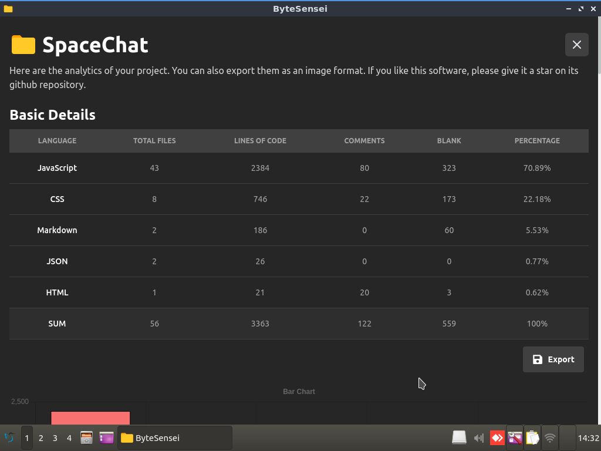
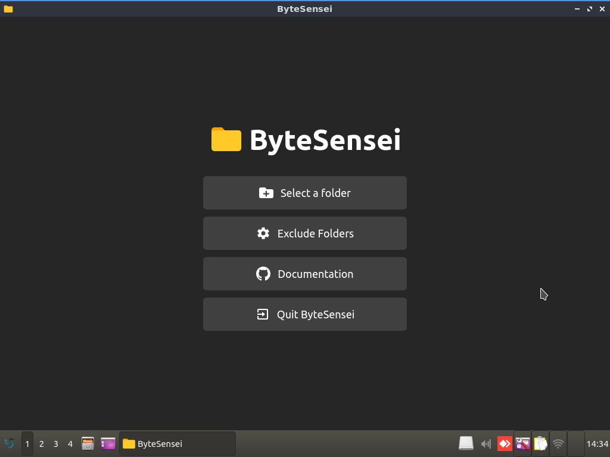
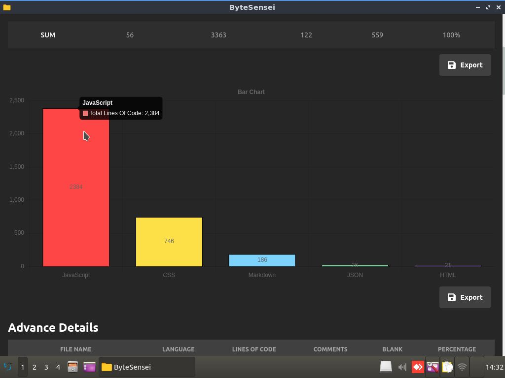
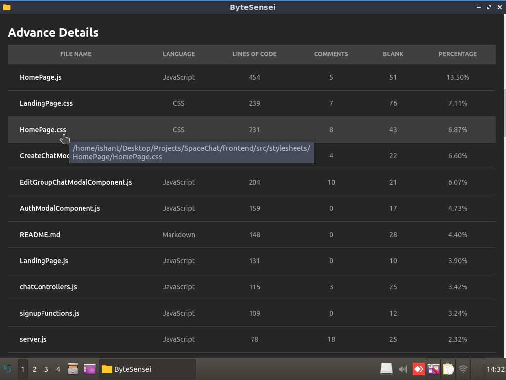
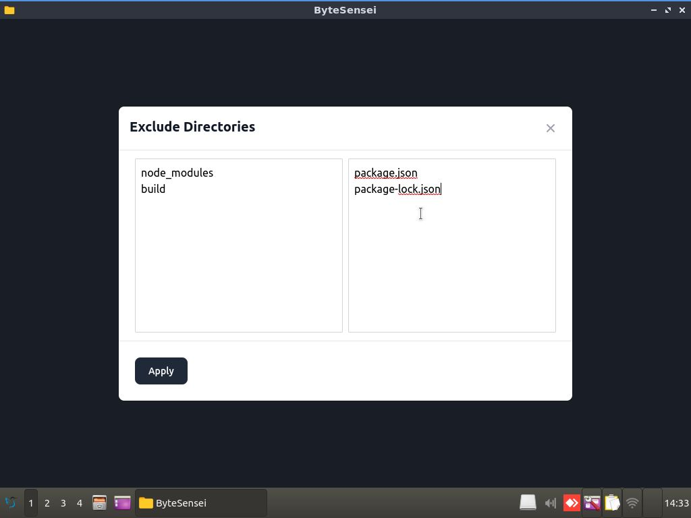
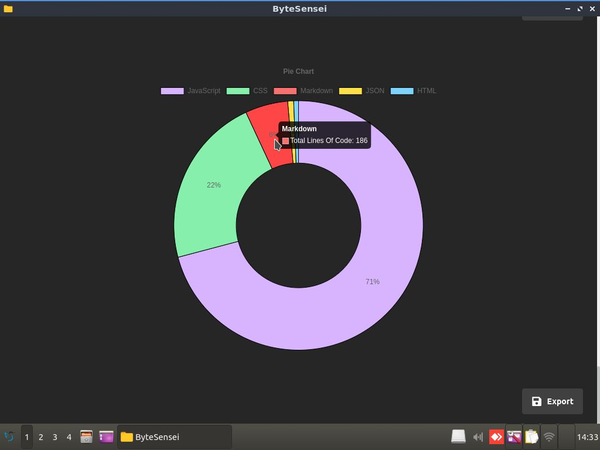

# ByteSensei
**ByteSensei** is a tool which analyses all the files in your project, figures out total number of lines of code in each file, programming languages used, total number of comments and much more!

## Demo
[Here](https://www.youtube.com/watch?v=Ps-0f0K6izM) is a short video on how to use ByteSensei

# ByteSensei Features :fire:
- Calculate total number of lines of code in your project
- Calculate total number of files
- Programming languages used in each file
- Total number of comments and blank lines in each file
- Interactive bar and dognut charts for representing analytics
- Export charts as png images
- Exclude files and folders

# Screenshots :camera_flash:
|   |   |
|---|---|
||  
| |   
|| |

# Usage :bulb:
1. Download this tool using the following links: [ByteSensei Linux](https://drive.google.com/file/d/1S8_G_S8uem61PgzHlbT2Dk3g3A1sCVfb/view?usp=sharing), [ByteSensei Windows](https://drive.google.com/file/d/1oaCi-QPgRzlXVd6OiMvTbHpF9D5qSr3-/view?usp=sharing)
2. Download cloc which is a command line tool that is necessary to make ByteSensei work properly. To download cloc, use the following links: [Cloc Linux](https://github.com/AlDanial/cloc/releases/download/v1.96/cloc-1.96.tar.gz) , [Cloc Windows](https://github.com/AlDanial/cloc/releases/download/v1.96/cloc-1.96.exe)
3. Now simply run ByteSensei

# Built Using :computer:
- Electron
- React
- TailwindCSS
- Node
- Cloc
- Javascript

## Project Setup :pencil:
If you want to clone this project and customize it further, you need to do a couple of tasks first:
1. Download this repository and open it in your text editor
2. In public/electron.js, comment and uncomment the code as shown below
```
//win.loadURL(`file://${path.join(__dirname, "../build/index.html")}`) 
win.loadURL("http://localhost:3000");
```
3. In src/App.js, press Ctrl+F and change HashRouter to BrowserRouter
4. Now open the terminal, write the following commands:
```
npm install
npm start
```
5. Finally, open a new terminal and write the following command:
```
npm run electron
```

You will see the app being launched on your computer.

## Generating EXE / APP / Linux Executable Files :memo:
1. To generate an executable file depending upon your platform, open public/electron.js file and there, comment the following line
```
win.loadURL("http://localhost:3000")
```
2. Then uncomment the following line
```
//win.loadURL(`file://${path.join(__dirname, "../build/index.html")}`) 
```
3. In src/App.js, press Ctrl+F and change BrowserRouter to HashRouter
4. Open terminal and write:
```
npm run build 
npx electron-packager .
```
5. This will build a .exe/.app/linux executable file depending on your operating system. To generate an executable file for some other platform, use the command below:
```
npx electron-packager <sourcedir> <appname> --platform=<platform> --arch=<arch> [optional flags...]
```

## Contact
For any queries, you can mail me at developerishant710@gmail.com


